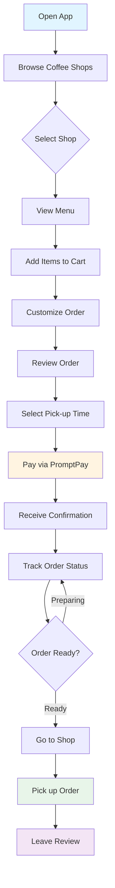
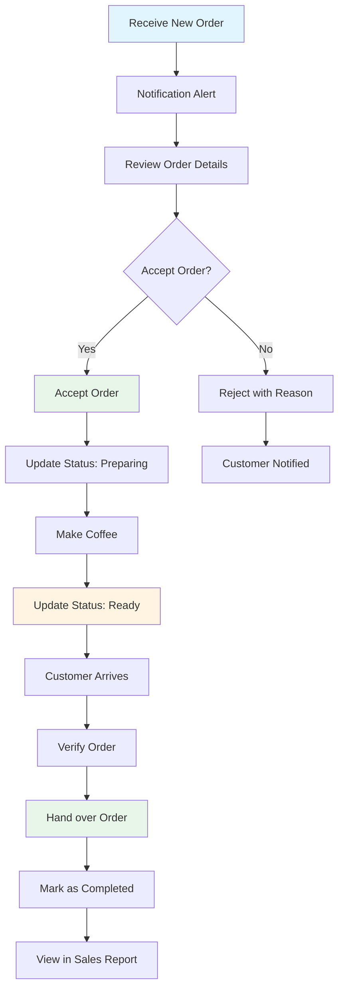

# PICK-ME-UP Platform Proposal
## Coffee Pick-up and Dine-in Platform for Stores and Consumers

**Document Version:** 2.0
**Date:** December 24, 2025
**Prepared by:** Digitalmedia Outsource Solution Co., Ltd.

---

## Table of Contents

### Business Overview
1. Executive Summary
2. Business Strategy
3. Market Analysis
4. Product Features

### Financial Analysis
5. Business Model and Revenue Streams
6. Investment Structure and Equity
7. Financial Projections (3-Year Forecast)
8. Return on Investment (ROI) Analysis
9. Success Metrics

### Competitive Position
10. Competitive Advantages and Moats
11. Risks and Mitigation

### Execution Plan
12. Go-to-Market Strategy
13. Team and Timeline
14. Investment Requirements
15. Technical Architecture

### Additional Information
16. Next Steps
17. Partnership with DOS
18. Contact Information
19. Appendix

---

## Executive Summary

PICK-ME-UP is a nationwide coffee shop aggregation platform focused exclusively on **Pick-up** and **Dine-in** orders, with **no delivery service**. The platform aims to reduce costs for both coffee shops and consumers while building a strong coffee community.

### The Business Opportunity

The Thai coffee market is valued at approximately **100 billion THB annually** with over **15,000 independent and SME coffee shops** nationwide. Despite this massive market, coffee shops are struggling with high platform fees that force them to either reduce margins or increase prices, making quality coffee less accessible to consumers.

### Problem Statement

Current food delivery platforms charge high commissions (25-35% per order), forcing coffee shops to increase prices significantly:
- **In-store price:** 70 THB
- **Delivery platform price:** 90 THB (+28.5% markup)
- **Shop's actual profit:** Reduced by 25-35% due to commission

**Impact on stakeholders:**
- **Coffee shops:** Forced to choose between lower margins or higher prices
- **Customers:** Pay 20-30% more for the same product
- **Market:** Quality coffee becomes less accessible, favoring larger chains over independents

### Our Solution

PICK-ME-UP offers a platform that:
- Charges significantly lower commission (5-10% vs 25-35%)
- Enables customers to purchase at in-store prices
- Eliminates the need for merchants to inflate prices
- Builds a coffee community through reviews and social features
- Creates sustainable revenue model for all stakeholders

### Investment Highlights

- **Total Investment (Phase 1 MVP):** 2,000,000 THB (50/50 split: DOS in-kind + Angel cash)
- **DOS Contribution:** 1,000,000 THB (development services)
- **Angel Investment:** 1,000,000 THB (marketing & operations)
- **Timeline:** 4-6 months to launch
- **Target ROI:** 2-3 years to positive return
- **Year 1 Revenue Target:** 3-4M THB (conservative MVP launch)
- **Market Strategy:** Niche focus on coffee shops only
- **Competitive Advantage:** 60-75% lower commission than competitors

---

## Business Strategy

### Core Value Proposition

**"Same price as in-store. Order easily. Pick up conveniently. Support local coffee shops."**

### Strategic Positioning

**Niche Market Leader vs Broad Platform Player**

PICK-ME-UP positions itself as the specialist platform for coffee lovers and coffee shops, rather than competing head-to-head with general food delivery platforms. This focused strategy provides several advantages:

**For Coffee Shops:**
- Lower commission means sustainable business model
- No need to inflate prices
- Maintain direct customer relationships
- Access to coffee-specific analytics
- Community of coffee enthusiasts

**For Customers:**
- Fair pricing (same as in-store)
- Curated coffee shop selection
- Community-driven reviews from fellow coffee lovers
- Discover local and independent shops
- Support small businesses

**For Platform (PICK-ME-UP):**
- Clear market differentiation
- Lower customer acquisition cost (targeted marketing)
- Higher customer loyalty (community-driven)
- Easier to achieve market leadership in niche
- Scalable business model without delivery logistics

### Key Differentiators

| Feature | PICK-ME-UP | Grab/Lineman |
|---------|------------|--------------|
| **Delivery Fee** | None | 15-50 THB |
| **Commission** | 5-10% | 25-35% |
| **Product Price** | Same as in-store | 20-30% higher |
| **Service Type** | Pick-up + Dine-in only | Delivery-focused |
| **Target** | Coffee shops only | General food |
| **Community** | Coffee enthusiast network | Transactional |
| **Shop Support** | Sustainable partnership | High-cost burden |

### Revenue Strategy

**Diversified Revenue Streams:**

**1. Transaction Commission (Primary - 50% of revenue)**
- Low commission rate (5-10%) ensures high volume
- Tiered pricing incentivizes shop growth
- Sustainable for long-term partnerships

**2. Subscription Plans (30% of revenue)**
- Predictable recurring revenue
- Better margins than commission
- Aligns incentives (shops want more orders)

**3. Advertising and Promotion (20% of revenue)**
- Featured listings
- Sponsored search results
- Banner advertising
- High-margin revenue stream

**Revenue Growth Drivers:**
- Network effects (more shops attract more customers)
- Increasing order frequency through loyalty programs
- Geographic expansion to new cities
- New revenue streams (corporate programs, gift cards)

### Customer Acquisition Strategy

**Cost-Effective Multi-Channel Approach:**

**Digital Marketing (60% of budget):**
- Social media (Instagram, TikTok) targeting coffee enthusiasts
- Search engine marketing (Google Ads) for branded terms
- Content marketing (coffee culture, shop stories)
- Influencer partnerships with coffee reviewers

**Partnership Marketing (25% of budget):**
- Co-marketing with coffee shops
- Cross-promotion with complementary brands
- Coffee events and festivals sponsorship
- Community building activities

**Referral Program (15% of budget):**
- Customer referral incentives
- Shop referral program
- Viral growth mechanics

**Target Customer Acquisition Cost:** <100 THB per user
**Target Customer Lifetime Value:** >1,000 THB (10:1 LTV:CAC ratio)

### Merchant Acquisition Strategy

**Three-Tier Approach:**

**Phase 1: Early Adopters (Months 1-3)**
- Target 50-100 innovative coffee shops
- Free commission for 3 months
- Intensive onboarding support
- Case study development

**Phase 2: Fast Followers (Months 4-6)**
- Leverage early adopter success stories
- Reduced commission (3%)
- Expand to 500 shops
- Streamlined onboarding

**Phase 3: Mass Market (Months 7-12)**
- Standard pricing (5-10%)
- Self-service onboarding
- Scale to 2,000+ shops
- Automated marketing

**Merchant Value Proposition:**
- 60-75% lower commission than competitors
- No price inflation needed
- Access to coffee enthusiast community
- Better customer insights
- Sustainable business model

### Operational Excellence

**Technology-Driven Efficiency:**
- Automated order routing and management
- Real-time analytics for shops
- Mobile-first architecture
- Cloud infrastructure for scalability
- API integrations with POS systems (future)

**Customer Service:**
- In-app support chat
- Shop support hotline
- Knowledge base and FAQs
- Training materials for shops
- Community forum

**Quality Control:**
- Shop verification process
- Customer review system
- Order accuracy monitoring
- Response time tracking
- Performance dashboards

---

## Product Features and Development Phases

### Phase 1 MVP Scope (Budget: 2M THB)

**Development Philosophy:** Launch with core features that enable basic ordering and pickup functionality. Focus on proving the business model with minimal viable features.

#### What's INCLUDED in Phase 1 (Must Have)

**Customer Mobile App (iOS + Android - Flutter):**
- Browse coffee shops near me (map + list view)
- View shop menu with photos and prices
- Place order (Pick-up only in Phase 1)
- Basic customization (sweetness, ice level, add-ons)
- PromptPay QR payment only
- Simple order tracking (3 states: Pending → Preparing → Ready)
- Push notifications for order status
- Basic user profile (name, phone, order history)
- Simple thumbs up/down review system

**Store Web Portal (Basic Dashboard):**
- Register and setup shop profile
- Add/edit menu items with photos
- Receive and accept orders
- Update order status (manual)
- View daily order list
- Basic sales report (daily/weekly)

**Backend & Infrastructure:**
- REST API (Node.js)
- PostgreSQL database
- Basic authentication (OTP via SMS)
- PromptPay payment integration
- Firebase for push notifications
- AWS/GCP cloud hosting (basic tier)
- Basic admin panel for platform management

**Essential 3rd Party Services:**
- Google Maps API (basic tier)
- Twilio SMS (for OTP)
- PromptPay Gateway
- Firebase Cloud Messaging
- Cloud hosting (minimal configuration)

#### What's EXCLUDED from Phase 1 (Nice to Have - Move to Phase 2)

**Customer Features (Deferred):**
- Dine-in ordering
- Schedule order for later
- Credit/debit card payment
- In-app wallet
- Text comments/reviews (only thumbs up/down in Phase 1)
- Follow reviewers feature
- Points and rewards system
- Favorites/saved items
- Advanced filters and search
- QR code for pickup

**Store Features (Deferred):**
- Advanced analytics and reports
- Promotion creation tools
- Inventory management
- Peak hours analysis
- Customer insights dashboard
- Multi-branch management
- API integrations

**Platform Features (Deferred):**
- Subscription plans for stores
- Advertising platform
- Featured listings
- Corporate program
- Gift cards
- Advanced recommendation engine
- Community feed
- Algolia search (use basic PostgreSQL search instead)

**Technical Optimizations (Deferred):**
- Redis caching
- Advanced monitoring (use basic logging)
- Auto-scaling infrastructure
- CDN integration
- Advanced security features

### Customer Journey Flow (Phase 1 MVP)

### Store Order Management Flow (Phase 1 MVP)

### Phase 1 MVP Feature Set (Detail)

### Customer Mobile Application

#### 1. Discovery and Browse
**Find Coffee Shops Near Me**
- Map view and list view display
- Filters: distance, coffee type, price range, ratings
- Search: shop name, menu items, area

**Shop Menu**
- Complete menu display (similar to Grab Food)
- Product images, prices, descriptions
- Icons indicating: Hot/Cold, sweetness level, caffeine level

#### 2. Ordering
**Place Order**
- **Select order type: Pick-up or Dine-in**
- Customization options: sweetness level, ice level, extra shots
- Special notes to店店
- Time selection: order now or schedule for later

**Payment**
- PromptPay QR Code
- Credit/Debit card
- **Pay at store** (for Dine-in orders)

#### 3. Order Tracking
**Track Order Status**
- Status flow: Pending confirmation → Preparing → Ready for pick-up
- Estimated pick-up time
- Push notifications at each step
- QR code for order collection

#### 4. Community Features
**Review System (Initial Version)**
- Vote: thumbs up / thumbs down
- **Text comments only (no photo upload in Phase 1)**
- View reviews from other users

**Follow Reviewers**
- Follow users whose reviews you trust
- See reviews from people you follow
- Build a trust network

#### 5. User Profile
**My Profile**
- Order history
- Favorites
- Points and rewards
- Account settings

### Store Portal (Web Application)

#### 1. Store Management
**Manage Store Information**
- Store details, logo, photos
- Operating hours
- Address and location pin
- Contact channels

#### 2. Menu Management
**Manage Menu (similar to Grab Merchant)**
- Add, edit, delete menu items
- Upload product images
- Set prices and customization options
- Mark items as temporarily unavailable (out of stock)

#### 3. Order Management
**Receive and Manage Orders**
- Dashboard showing all orders
- Accept orders
- Update order status (Preparing → Ready)
- Order history

#### 4. Analytics and Reports
**Reports and Analytics**
- Daily and monthly sales
- Best-selling items
- Peak hours analysis
- Customer insights

---

## Business Model

### Revenue Streams

#### 1. Commission from Stores (Primary Revenue)

**Commission Rates:**
- **Tier 1** (Small shops): 8-10% per order
- **Tier 2** (Medium shops): 6-8% per order
- **Tier 3** (Large chains): 5-6% per order

**Comparison:**
- Grab Food/Lineman: 25-35%
- **PICK-ME-UP: 5-10%** (60-75% lower)

#### 2. Subscription Plans (For Stores)

**Basic Plan: Free**
- 10% commission per order
- Standard features

**Pro Plan: 2,500 THB/month**
- 5% commission per order
- Advanced analytics
- Priority support
- Promotion tools

**Enterprise Plan: 5,000 THB/month**
- 3% commission per order
- Multi-branch support
- Dedicated account manager
- Custom integration
- API access

#### 3. Advertising and Promotion
- **Featured Listings:** Top placement in search results
- **Banner Ads:** In-app advertising
- **Sponsored Search:** Priority in search results

### Pricing Strategy

#### Launch Phase (First 6 months)
- **0% commission** for first 100 stores (first 3 months)
- **3% commission** months 4-6
- **Free setup and training**

#### Growth Phase (Months 7-12)
- Standard commission rates (5-10%)
- Launch subscription plans
- Open advertising platform

---

## Investment Structure and Equity

### Phase 1 MVP Investment Model

**Total Project Valuation (Phase 1):** 2,000,000 THB

**Equity Structure:**

#### DOS Contribution (In-Kind)
- **Development Services:** MVP platform development
- **Valuation:** 1,000,000 THB
- **Form:** Intellectual property contribution
- **Equity:** 50% ownership

#### Angel Investor Contribution (Cash)
- **Marketing & Operations Investment:** 1,000,000 THB
- **Purpose:** Customer acquisition, brand building, initial operations
- **Form:** Cash investment
- **Equity:** 50% ownership

### Phase 1 Investment Breakdown

**DOS In-Kind Contribution: 1,000,000 THB**

Development costs breakdown:
- Mobile App (Flutter - iOS + Android): 400,000 THB
- Backend API (Node.js + PostgreSQL): 250,000 THB
- Store Web Portal (React): 150,000 THB
- Payment Integration (PromptPay): 50,000 THB
- Authentication & Security: 50,000 THB
- Admin Panel: 50,000 THB
- QA Testing: 30,000 THB
- Project Management: 20,000 THB

**Angel Investor Cash Investment: 1,000,000 THB**

Marketing and operations breakdown:
- Launch Marketing Campaign: 300,000 THB
- Partner Acquisition (20-30 pilot stores): 200,000 THB
- Customer Acquisition: 200,000 THB
- Cloud Hosting (6 months): 100,000 THB
- 3rd Party Services (6 months): 100,000 THB
  - Google Maps API
  - Twilio SMS
  - PromptPay fees
  - Firebase
- Support & Operations: 100,000 THB

### Intellectual Property Rights

**Joint Ownership Structure:**
- Platform source code: Co-owned 50/50
- Brand and trademarks: Co-owned 50/50
- Customer database: Co-owned 50/50
- Business methodology: Co-owned 50/50

**Decision-Making:**
- Major business decisions require mutual consent
- Operational decisions follow agreed governance model
- Future funding rounds require both parties' approval

### Phase 2 Expansion Plan (Future Investment)

When Phase 1 proves successful and additional capital is needed:

**Option 1: Bootstrap Growth**
- Self-fund from revenue
- Maintain 50/50 ownership
- Slower but sustainable growth

**Option 2: Additional Investment Round**
- Raise 3-5M THB for full feature set
- New investors: 20-30% equity
- DOS and Angel dilute proportionally
- Maintain co-founder control

**Option 3: Strategic Partnership**
- Partner with payment provider or retail chain
- Exchange features for investment
- Leverage partner's customer base

---

## Technical Architecture

### Technology Stack

#### Frontend
- **Customer Mobile App:** Flutter (iOS + Android)
- **Store Web Portal:** React.js with TypeScript
- **Admin Portal:** React.js with TypeScript

#### Backend
- **API Server:** Node.js with Express or NestJS
- **Database:** PostgreSQL (primary) + Redis (caching)
- **Real-time:** Firebase Realtime Database or Pusher
- **File Storage:** AWS S3 or Google Cloud Storage

#### Integration and Services
- **Maps:** Google Maps API
- **Payment:** PromptPay, Stripe, Omise
- **Push Notifications:** Firebase Cloud Messaging (FCM)
- **SMS:** Twilio (for OTP)
- **Search:** Algolia (for menu and store search)

#### Infrastructure
- **Cloud Platform:** Google Cloud Platform or AWS
- **Containerization:** Docker
- **Orchestration:** Kubernetes
- **CI/CD:** GitHub Actions
- **Monitoring:** Google Cloud Monitoring or DataDog

---

## Go-to-Market Strategy

### Phase 1: Pilot Launch (Months 1-3)

#### Target Area
**Bangkok - Selected Districts**
- Silom, Sathorn (office workers)
- Ari, Ekkamai (coffee enthusiasts)
- Thonglor (premium segment)

#### Partner Acquisition
- **Target:** 50-100 coffee shops
- **Incentive:** Free commission for 3 months
- **Approach:**
  - Direct sales team
  - Coffee community events
  - Social media outreach

#### Customer Acquisition
**App Launch Campaign**
- Free coffee on first order
- 20% cashback on first 5 orders

**Referral Program**
- Points for both referrer and referee
- Rewards for successful referrals

**Marketing Channels:**
- Instagram and TikTok (coffee content)
- Facebook groups (coffee lovers)
- Google Ads (branded search)
- Partnerships with coffee influencers

### Phase 2: Bangkok Expansion (Months 4-6)
- Expand coverage to all Bangkok districts
- Increase to 500 partner stores
- Launch loyalty program
- PR campaign and media coverage

### Phase 3: Regional Expansion (Months 7-12)
- Expand to Chiang Mai, Phuket, Pattaya
- Focus on tourist areas and university towns
- Local partnerships
- Target: 2,000 stores nationwide

---

## Team and Timeline

### Phase 1 MVP Development Team (DOS)

**Lean Team (5-6 people):**
- 1 Project Manager / Lead Developer (part-time)
- 1 Senior Backend Developer (Node.js + PostgreSQL)
- 1 Senior Mobile Developer (Flutter)
- 1 Frontend Developer (React - for Store Portal)
- 1 UI/UX Designer (part-time / contract)
- QA Testing (shared across team + external QA as needed)

**Team Working Model:**
- Agile methodology with 2-week sprints
- Full-time core developers (Backend, Mobile, Frontend)
- Part-time specialists (PM, Designer, QA)
- Remote-first team to optimize costs

### Phase 1 MVP Timeline (4-5 Months)

**Month 1: Design and Planning (Weeks 1-4)**
- Week 1-2: Requirements finalization and scope lock
- Week 2-3: UI/UX design (wireframes + mockups)
- Week 3-4: Technical architecture and database design
- Deliverable: Complete design system and technical specs

**Month 2: Core Development (Weeks 5-8)**
- Backend API foundation (authentication, basic CRUD)
- Mobile app shell and navigation
- Store portal foundation
- Database schema implementation
- Deliverable: Working authentication and basic app structure

**Month 3: Feature Development (Weeks 9-12)**
- Order placement and management flow
- Payment integration (PromptPay)
- Shop browsing and menu display
- Push notifications
- Deliverable: Feature-complete but unpolished

**Month 4: Integration and Testing (Weeks 13-16)**
- Integration testing
- Bug fixes and refinements
- Internal testing with DOS team
- Performance optimization
- Deliverable: Beta-ready application

**Month 5: Beta Launch and Iteration (Weeks 17-20)**
- Beta testing with 5-10 pilot stores
- User feedback collection
- Critical bug fixes
- Final polish and adjustments
- Deliverable: Production-ready MVP

**Week 21: Official Launch**
- Deploy to production
- Onboard first 20-30 stores
- Launch marketing campaign
- Monitor and provide support

### Realistic Expectations

**What we CAN deliver in 4-5 months with 1M budget:**
- Functional mobile app (iOS + Android)
- Basic store web portal
- Core ordering and payment flow
- Essential features for business operation
- Stable, secure, and scalable foundation

**What we CANNOT deliver in Phase 1:**
- Polished UI/UX (will improve iteratively)
- Advanced features (deferred to Phase 2)
- Perfect performance optimization
- Comprehensive analytics
- Marketing automation

**Success Criteria for Phase 1:**
- App works reliably for basic pick-up orders
- Stores can manage orders without issues
- Payment processing is secure and accurate
- Platform can handle 20-30 stores and 100+ daily orders
- Foundation ready for Phase 2 enhancements

---

## Phase 1 Investment Requirements

### Development Investment (DOS): 1,000,000 THB

**Labor Costs:**
- Senior Backend Developer (4 months): 300,000 THB
- Senior Mobile Developer (4 months): 300,000 THB
- Frontend Developer (4 months): 200,000 THB
- Project Manager (part-time, 4 months): 100,000 THB
- UI/UX Designer (contract): 60,000 THB
- QA Testing: 40,000 THB

**Total Labor: 1,000,000 THB**

### Marketing & Operations Investment (Angel): 1,000,000 THB

**Marketing (6 months):**
- Launch Campaign (social media, influencers): 300,000 THB
- Partner Acquisition (incentives for 20-30 stores): 200,000 THB
- Customer Acquisition (promotions, ads): 200,000 THB
- Content Creation (photos, videos): 50,000 THB

**Operations (6 months):**
- Cloud Hosting (AWS/GCP basic tier): 100,000 THB
- 3rd Party Services:
  - Google Maps API: 30,000 THB
  - Twilio SMS (OTP): 20,000 THB
  - PromptPay transaction fees: 20,000 THB
  - Firebase: 10,000 THB
  - Domain, SSL, misc: 10,000 THB
- Customer Support (part-time staff): 70,000 THB

**Total Angel Investment: 1,000,000 THB**

### Total Phase 1 Investment: 2,000,000 THB

**Breakdown:**
- Development: 1,000,000 THB (DOS in-kind)
- Marketing: 750,000 THB (Angel cash)
- Operations: 250,000 THB (Angel cash)

**Equity Split:** 50/50 (DOS/Angel)

### Monthly Operating Costs (After Launch - Month 6+)

**Minimum Operating Costs:**
- Cloud Hosting: 15,000 THB/month
- 3rd Party Services: 10,000 THB/month
- Customer Support (part-time): 12,000 THB/month
- Marketing (organic + minimal paid): 30,000 THB/month
- Development Maintenance (bug fixes): 25,000 THB/month

**Total: ~100,000 THB/month (minimum)**

**Note:** These costs should be covered by revenue starting Month 7-8 based on conservative projections.

---

## Market Analysis

### Thai Coffee Market Overview

**Market Size and Growth:**
- Total market value: 100 billion THB/year (2024)
- Annual growth rate: 8-10%
- Number of coffee shops: 15,000+ (independent and SME)
- Average orders per shop: 50-100 orders/day
- Average ticket size: 80-150 THB

**Market Segments:**
- **Independent coffee shops:** 60% of market (9,000+ shops)
- **Small-medium chains:** 25% of market (3,750+ shops)
- **Large chains:** 15% of market (2,250+ shops)

**Target Addressable Market (TAM):**
- Focus on independent and small-medium chains: 85% of total market
- Estimated TAM: 85 billion THB/year
- Target market penetration (Year 3): 2% = 1.7 billion THB GMV

### Customer Segments

**Primary Target: Urban Coffee Consumers**
- **Office workers (40%):** Order ahead for morning coffee or afternoon break
- **Coffee enthusiasts (30%):** Seek quality and variety, willing to travel
- **Local supporters (20%):** Prefer supporting independent shops
- **Value seekers (10%):** Price-conscious but quality-aware

**Geographic Focus:**
- Phase 1: Bangkok metropolitan area (8M+ population)
- Phase 2: Major cities (Chiang Mai, Phuket, Pattaya)
- Phase 3: Provincial capitals and tourist destinations

### Competitive Landscape

**Direct Competitors:**
- **Grab Food:** 35% market share, 25-35% commission
- **Lineman:** 30% market share, 25-35% commission
- **Robinhood:** 15% market share, 20-25% commission
- **Others:** 20% market share

**PICK-ME-UP Differentiation:**
- Niche focus (coffee only) vs broad food delivery
- 60-75% lower commission structure
- No delivery = no logistics complexity
- Community-driven vs transaction-focused
- Support for local businesses vs platform dominance

**Barriers to Entry:**
- Network effects (more shops = more customers = more shops)
- Technology platform investment
- Brand recognition and trust
- Operational expertise

---

## Financial Projections

### Key Business Assumptions

**Revenue Model:**
- Average Order Value (AOV): 120 THB
- Average Commission Rate: 8%
- Revenue per Order: 9.6 THB
- Monthly Active User Rate: 60%
- Order Frequency: 3 orders/user/month
- Customer Retention (Year 2): 40%

**Cost Structure:**
- Technology & Infrastructure: 5% of revenue
- Marketing & Sales: 35% of revenue (Year 1), declining to 20% (Year 3)
- Operations & Support: 15% of revenue
- Platform Development: One-time investment (11M THB)

### Three-Year Financial Forecast

#### Year 1 (Launch Year - MVP Phase)

**Market Metrics (Conservative with MVP):**
- Target Stores: 30-50 stores (pilot phase)
- Target Users: 5,000-8,000 users
- Monthly Active Users: 3,000-5,000 users
- Average Orders per User per Month: 2-3
- Monthly Orders (Month 12): 10,000 orders/month
- Total Annual Orders: 60,000 orders (ramping up from zero)

**Revenue (Commission Only - No subscriptions or ads in MVP):**
- Commission Revenue: 576,000 THB (60k orders × 9.6 THB)
- Subscription Revenue: 0 THB (not available in Phase 1)
- Advertising Revenue: 0 THB (not available in Phase 1)
- **Total Revenue: 576,000 THB**

**Expenses (Post-Launch - 6 months):**
- Marketing (organic + minimal paid): 180,000 THB
- Operations (hosting, services, support): 120,000 THB
- Development Maintenance: 150,000 THB
- **Total Expenses: 450,000 THB**

**Year 1 EBITDA: 126,000 THB (22% margin)**

**Note:** Year 1 focuses on proving the business model with limited scope. Profitability achieved in Month 8-9.

#### Year 2 (Growth Year - With Phase 2 Features)

**Assumptions:** Raise additional funding or bootstrap from Year 1 revenue to add Phase 2 features

**Market Metrics:**
- Target Stores: 150-200 stores
- Target Users: 25,000-30,000 users
- Monthly Active Users: 15,000-18,000 users
- Monthly Orders: 40,000 orders/month
- Total Annual Orders: 400,000 orders

**Revenue:**
- Commission Revenue: 3,840,000 THB (400k orders × 9.6 THB)
- Subscription Revenue: 360,000 THB (30 stores × 2,500/month × 12 × 20% adoption)
- Advertising Revenue: 500,000 THB (starting to monetize)
- **Total Revenue: 4,700,000 THB**

**Expenses:**
- Marketing & Sales: 1,200,000 THB (25% of revenue)
- Operations & Support: 700,000 THB (15% of revenue)
- Technology & Infrastructure: 300,000 THB (5% of revenue)
- Phase 2 Development: 500,000 THB (adding deferred features)
- **Total Expenses: 2,700,000 THB**

**Year 2 EBITDA: 2,000,000 THB (43% margin)**

#### Year 3 (Scale Year - Full Platform)

**Market Metrics:**
- Target Stores: 400-500 stores
- Target Users: 60,000-80,000 users
- Monthly Active Users: 36,000-48,000 users
- Monthly Orders: 100,000 orders/month
- Total Annual Orders: 1,000,000 orders

**Revenue:**
- Commission Revenue: 9,600,000 THB (1M orders × 9.6 THB)
- Subscription Revenue: 900,000 THB (75 stores × 2,500/month × 12 × 20%)
- Advertising Revenue: 1,500,000 THB (mature ad platform)
- **Total Revenue: 12,000,000 THB**

**Expenses:**
- Marketing & Sales: 2,400,000 THB (20% of revenue)
- Operations & Support: 1,800,000 THB (15% of revenue)
- Technology & Infrastructure: 600,000 THB (5% of revenue)
- **Total Expenses: 4,800,000 THB**

**Year 3 EBITDA: 7,200,000 THB (60% margin)**

### Cumulative Financial Summary (3 Years)

- **Total Revenue:** 17,276,000 THB
- **Total EBITDA:** 9,326,000 THB
- **Average EBITDA Margin:** 54%
- **Total GMV (Gross Merchandise Value):** ~175,000,000 THB

**Note:** These projections are based on organic growth with minimal additional investment. With Series A funding in Year 2, growth could be significantly accelerated.

---

## Return on Investment (ROI) Analysis

### Investment Summary

**Total Phase 1 Investment: 2,000,000 THB**
- DOS Contribution (Development): 1,000,000 THB (50% equity)
- Angel Investor (Marketing & Operations): 1,000,000 THB (50% equity)

### ROI Projections

#### Scenario Analysis

**Base Case (MVP Launch - Projections as stated):**

**Year 1:**
- Revenue: 576,000 THB
- EBITDA: 126,000 THB
- Cumulative Cash Flow: -1,874,000 THB (2M investment - 126k EBITDA)
- ROI: -94%

**Year 2:**
- Revenue: 4,700,000 THB
- EBITDA: 2,000,000 THB
- Cumulative Cash Flow: 126,000 THB (Break-even achieved!)
- ROI: 6% (cumulative)
- **Payback achieved in Month 22-24**

**Year 3:**
- Revenue: 12,000,000 THB
- EBITDA: 7,200,000 THB
- Cumulative Cash Flow: 7,326,000 THB
- **ROI: 266% (cumulative over 3 years)**
- **Annual ROI: 89% average per year**

#### Conservative Case (60% of base case)

**Assumptions:** Slower adoption, limited marketing success
- Year 1 Revenue: 346,000 THB | EBITDA: 76,000 THB
- Year 2 Revenue: 2,820,000 THB | EBITDA: 1,200,000 THB
- Year 3 Revenue: 7,200,000 THB | EBITDA: 4,320,000 THB
- **3-Year Cumulative EBITDA: 5,596,000 THB**
- **ROI: 180% over 3 years**
- **Payback Period: 30 months**

#### Optimistic Case (150% of base case)

**Assumptions:** Strong market adoption, successful marketing, potential Series A in Year 2
- Year 1 Revenue: 864,000 THB | EBITDA: 189,000 THB
- Year 2 Revenue: 7,050,000 THB | EBITDA: 3,000,000 THB
- Year 3 Revenue: 18,000,000 THB | EBITDA: 10,800,000 THB
- **3-Year Cumulative EBITDA: 13,989,000 THB**
- **ROI: 600% over 3 years**
- **Payback Period: 18 months**

### ROI Comparison Table (Phase 1 - 2M THB Investment)

| Scenario | 3-Year Revenue | 3-Year EBITDA | ROI | Payback Period |
|----------|----------------|---------------|-----|----------------|
| Conservative | 10.4M THB | 5.6M THB | 180% | 30 months |
| **Base Case** | **17.3M THB** | **9.3M THB** | **366%** | **24 months** |
| Optimistic | 25.9M THB | 14.0M THB | 600% | 18 months |

### Exit Strategy and Valuation (Phase 1 MVP)

**Realistic Exit Options (Year 3-4):**

**1. Strategic Acquisition**
- Potential acquirers: Food delivery platforms, payment companies, coffee chains, retail tech
- Valuation multiple: 2-3x revenue or 5-8x EBITDA (conservative for early stage)
- **Estimated valuation (Year 3):** 24M - 60M THB
  - Based on 2x revenue: 24M THB (12M revenue × 2)
  - Based on 6x EBITDA: 43M THB (7.2M EBITDA × 6)
  - Based on 5x revenue: 60M THB (12M revenue × 5, if strategic value)

**2. Series A Funding**
- Timing: Year 2 after proving business model
- Raise: 3-5M THB for Phase 2 features and expansion
- Pre-money valuation: 8M - 15M THB
- Investor equity: 20-30%
- DOS and Angel dilute proportionally but maintain control

**3. Bootstrap and Continue Operations**
- Maintain profitable operations without external funding
- Grow organically using revenue
- Dividend distribution to shareholders starting Year 3
- Annual dividend: 30-40% of net profit
- **Estimated annual dividend (Year 3+):** 2M - 3M THB

**4. Merge with Complementary Business**
- Partner with payment gateway (KBank, SCB, etc.)
- Integrate with POS system provider
- White-label for coffee chains
- Valuation: Negotiated based on strategic value

### Investment Return Summary

**For 1,000,000 THB Investment (50% equity):**

**Conservative Scenario (Exit Year 3):**
- Company Valuation: 24M THB (2x revenue)
- 50% Equity Value: 12M THB
- Net Return: 11M THB profit
- **ROI: 1,100% (11x return)**

**Base Case Scenario (Exit Year 3):**
- Company Valuation: 40M THB (3.3x revenue or 5.5x EBITDA)
- 50% Equity Value: 20M THB
- Net Return: 19M THB profit
- **ROI: 1,900% (20x return)**

**Optimistic Scenario (Exit Year 3):**
- Company Valuation: 60M THB (5x revenue with strategic premium)
- 50% Equity Value: 30M THB
- Net Return: 29M THB profit
- **ROI: 2,900% (30x return)**

**Bootstrap Scenario (No exit, dividends only):**
- Year 3 dividend (40% of 7.2M EBITDA): 2.88M THB
- Annual dividends continuing
- 3-year cumulative dividends: ~5M THB
- Plus: Still own 50% of operating business
- **ROI: 500%+ (5x return) plus ongoing dividends**

### Risk-Adjusted Return (Phase 1 - 2M Investment)

**Risk Factors and Probability:**
- Market adoption slower than expected: 35% probability
- Competitive response or market changes: 25% probability
- Execution challenges (technical, team, operations): 20% probability
- Success as planned or better: 20% probability

**Expected Value Calculation:**
- Conservative Case (35% probability): 24M THB × 0.35 = 8.4M THB
- Base Case (25% probability): 40M THB × 0.25 = 10M THB
- Optimistic Case (20% probability): 60M THB × 0.20 = 12M THB
- Partial success / Bootstrap (20% probability): 15M THB × 0.20 = 3M THB
- **Risk-Adjusted Expected Valuation: 33.4M THB**
- **Risk-Adjusted Investor Return (50%):** 16.7M THB
- **Risk-Adjusted ROI:** 1,570% over 3 years (15.7x return)

### Key Investment Thesis

**Why this is an attractive investment despite smaller scale:**

1. **Capital Efficient:** 2M THB vs typical 10-20M THB for similar platforms
2. **Quick Payback:** 24 months vs industry standard 36-48 months
3. **Lean Operation:** Lower burn rate means longer runway
4. **Proven Team:** DOS has track record with similar platforms
5. **Clear Exit Path:** Multiple potential acquirers in growing market
6. **Asymmetric Risk/Reward:** Limited downside (2M), significant upside (20-30M)
7. **Market Timing:** Coffee culture growing, delivery fatigue setting in
8. **Defensible Niche:** Coffee-only focus creates community moat

**Bottom Line:** Even in conservative scenario with no exit, investors can expect **5-10x return through dividends alone** within 3-4 years. With successful exit, **15-30x returns are achievable**.

---

## Success Metrics

### Key Performance Indicators

#### Platform Health
- Total Registered Stores
- Active Stores (>80% of registered)
- Total Users
- Monthly Active Users (MAU >60%)

#### Transaction Metrics
- Monthly Orders
- Average Order Value (120+ THB)
- Order Frequency (3+ orders/user/month)
- Repeat Purchase Rate (>40%)

#### Financial Metrics
- Gross Merchandise Value (GMV)
- Platform Revenue
- Customer Acquisition Cost (CAC <100 THB)
- Customer Lifetime Value (LTV >1,000 THB)

#### Quality Metrics
- Store Satisfaction (>4.0/5.0)
- Customer Satisfaction (>4.5/5.0)
- App Store Rating (>4.3/5.0)
- Order Accuracy (>98%)

---

## Competitive Advantages and Moats

### 1. Cost Leadership in Niche Market
**60-75% lower commission than general platforms**

- **Economic advantage:** Shops save 15-25% per order
- **Pricing power:** Customers pay in-store prices
- **Volume driver:** Lower costs attract more merchants
- **Sustainability:** Business model works for all parties long-term

**Why we can sustain lower costs:**
- No delivery logistics infrastructure needed
- No driver management or routing algorithms
- Lower customer acquisition cost (focused targeting)
- Simpler operations = lower overhead

### 2. Network Effects and Community

**The more shops join, the more valuable the platform becomes**

- **Supply-side:** More shops = more variety for customers
- **Demand-side:** More customers = more orders for shops
- **Data advantage:** More transactions = better insights and recommendations
- **Community effects:** Reviewers attract followers, creating social network

**Defensive moat:** Once established, difficult for competitors to replicate the community and network density

### 3. Vertical Specialization

**Coffee-only focus creates deep expertise**

- **Product expertise:** Understand coffee shop operations deeply
- **Feature optimization:** Every feature designed for coffee ordering
- **Marketing efficiency:** Targeted to coffee enthusiasts only
- **Brand positioning:** "The coffee platform" vs "general food delivery"

**Competitive barrier:** General platforms cannot match depth of coffee expertise without diluting their broad positioning

### 4. Brand as Community Platform

**Not just transactional, but social and community-driven**

- **Trust network:** Follow reviewers you trust
- **Discovery:** Find new shops through community
- **Loyalty:** Supporting local businesses creates emotional connection
- **Engagement:** Beyond transactions, users engage with content

**Switching cost:** Users build social capital (followers, reputation) that doesn't transfer to other platforms

### 5. Technology and Operational Efficiency

**Built for scalability from day one**

- **Cloud-native architecture:** Auto-scaling, high availability
- **Mobile-first:** Optimized for smartphone usage
- **API-driven:** Easy integrations with other systems
- **Data-driven:** Real-time analytics and optimization

**Advantage:** Technology built specifically for this use case, not adapted from delivery platform

### 6. Strategic Partnerships

**DOS brings proven experience and relationships**

- **Technical credibility:** 10+ years, 100+ projects
- **Industry connections:** Relationships with major Thai corporations
- **Delivery expertise:** Prior work on Foodhunt, CPAC Delivery
- **Execution capability:** Track record of launching platforms successfully

**Barrier:** Competitors need both capital AND execution expertise

### Why Competitors Cannot Easily Copy

**Large platforms (Grab, Lineman) face strategic constraints:**
- Cannot lower commission without cannibalizing core business
- Cannot focus on coffee without alienating restaurant partners
- Delivery infrastructure is both asset and liability
- Organization optimized for broad market, not niche

**New entrants face chicken-and-egg problem:**
- Need shops to attract customers
- Need customers to attract shops
- PICK-ME-UP solves this through low commission and community
- First-mover advantage in building coffee shop network

**Timeline advantage:** 12-18 months to achieve critical mass creates defensible position

---

## Risks and Mitigation

### 1. Customer Behavior Risk

**Challenge:** Customers accustomed to delivery convenience

**Mitigation:**
- Education campaign highlighting real savings
- Incentivize pick-up orders
- Emphasize convenience of ordering ahead
- Schedule pickup for optimal times

### 2. Merchant Adoption Risk

**Challenge:** Coffee shops familiar with existing platforms

**Mitigation:**
- Free commission during launch phase
- Comprehensive training and support
- Showcase results from pilot stores
- Simple onboarding process

### 3. Market Competition Risk

**Challenge:** Major platforms (Grab/Lineman) might reduce commissions

**Mitigation:**
- Build strong brand loyalty through community
- Maintain niche focus on coffee
- Superior UX specifically for coffee ordering
- Value-added services beyond ordering

### 4. Technology Risk

**Challenge:** Technical issues and downtime

**Mitigation:**
- High-availability cloud infrastructure
- Regular testing and monitoring
- Quick response team
- Disaster recovery plan

---

## Next Steps

### Immediate Actions (First 30 Days)

**1. Concept Validation**
- Interview 20-30 coffee shop owners
- Survey coffee consumers
- Analyze willingness to pay

**2. Business Planning**
- Detailed financial model
- Legal structure setup
- Shareholders agreement drafting

**3. Technical Planning**
- Finalize technology stack
- Complete architecture design
- Security and compliance review

**4. Team Formation**
- Confirm DOS development team
- Recruit business team members
- Onboard key stakeholders

### Meeting Agenda

**1. Business Model Validation**
- Confirm revenue model
- Adjust commission rates if necessary
- Finalize subscription tiers

**2. Scope Confirmation**
- Validate MVP features
- Define Phase 2-3 roadmap
- Prioritize feature development

**3. Investment Approval**
- Review investment structure
- Confirm equity split
- Finalize shareholders agreement

**4. Timeline Agreement**
- Confirm 6-month development timeline
- Set milestone deliverables
- Agree on launch date

---

## Partnership with DOS

### Why Digitalmedia Outsource Solution?

#### Proven Track Record
- 10+ years of experience
- 100+ projects delivered successfully
- Expert in e-commerce and food delivery platforms
- Major clients: SCG, CP ALL, Central Group

#### Relevant Experience
- **Foodhunt (CRG):** Online food ordering platform
- **CPAC Delivery:** Delivery application
- **Shop at 24:** E-commerce application
- **Multiple loyalty and rewards systems**

#### Technical Expertise
- Cloud architecture (Google Cloud, AWS)
- Mobile app development (Flutter, native iOS/Android)
- Payment gateway integration
- Real-time systems implementation
- API development and integration

### Engagement Model

**Team Composition:**
- 9 developers and designers
- 1 Lead + 3 Senior + 3 Junior + 1 Designer + 1 QA

**Timeline:** 6 months (Development to Launch)

**DOS Contribution:** 5,500,000 THB (in-kind development services)
**Equity:** 50% ownership

---

## Contact Information

**Digitalmedia Outsource Solution Co., Ltd.**

**Jakapong Lomvong (TLE)**
Chief Operating Officer

Email: jakapong@digitalmedia.co.th
Phone: +66 88-622-2488

**Company Address:**
91/11 Moo 2, Banmai, Pak Kret
Nonthaburi, Thailand 11120

**Tax ID:** 0105555063821

---

## Appendix

### A. Platform Comparison

| Platform | Type | Commission | Delivery | Focus |
|----------|------|------------|----------|-------|
| Grab Food | Food Delivery | 25-35% | Yes | General food |
| Lineman | Food Delivery | 25-35% | Yes | General food |
| Robinhood | Food Delivery | 20-25% | Yes | General food |
| **PICK-ME-UP** | **Coffee Platform** | **5-10%** | **No** | **Coffee only** |

### B. Target Coffee Shop Categories

**1. Independent Coffee Shops**
- Local neighborhood cafes
- Specialty coffee roasters
- Artisan coffee bars

**2. Small to Medium Chains**
- Local chains with 3-10 branches
- Regional coffee brands

**3. Premium Coffee Shops**
- Third-wave coffee specialists
- Competition-grade coffee
- Import bean specialists

**4. Niche Locations**
- Office building cafes
- Hospital cafes
- University cafes
- Co-working space cafes

### C. Technology Considerations

**Security:**
- PCI DSS compliance for payments
- PDPA compliance (Thai data protection law)
- SSL/TLS encryption
- OWASP Top 10 protection

**Scalability:**
- Auto-scaling infrastructure
- CDN for static assets
- Database optimization
- Redis caching strategy

**Reliability:**
- 99.9% uptime SLA target
- Disaster recovery plan
- Regular automated backups
- 24/7 system monitoring

---

**Document Status:** Draft for Discussion
**Version:** 2.0
**Date:** December 24, 2025
**Prepared by:** Digitalmedia Outsource Solution Co., Ltd.

**Confidential:** This document contains proprietary information and is intended for discussion purposes only.
